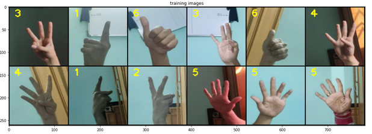

# Hand Cricket

## Table of Content
  * [Overview](#overview)
  * [Installation](#installation)
  * [Game rules](#game-rules)
  * [Project Details](#project-details)
  * [Future scope](#future-scope)

## [Overview](#table-of-content)
This is a computer vision based implementation of the popular childhood game 'Hand Cricket/Odd or Even' in python. Behind the game is a CNN model that is trained to identify hand sign for numbers 0,1,2,3,4,5 & 6. For those who have never played this game, the rules are explained below.

**
The Game in action
**

https://user-images.githubusercontent.com/38727070/148494643-f34c495e-d1f6-4415-b335-100565c60c00.mov

 

## [Installation](#table-of-content)
- You need Python (3.6) & git (to clone this repo)
- `git clone git@github.com:abhinavnayak11/Hand-Cricket.git .` : Clone this repo
- `cd path/to/Hand-Cricket` : cd into the project folder
- `conda env create -f environment.yml` : Create a virtual env with all the dependencies
- `conda activate comp-vision` : activate the virtual env
- `python src/hand-cricket.py` : Run the script

 

## [Game rules](#table-of-content)

**Hand signs**
- You can play numbers 0, 1, 2, 3, 4, 5, 6. Their hand sign are shown [here](static)    

**Toss** 
- You can choose either odd or even (say you choose odd)
- Both the players play a number (say players play 3 & 6). Add those numbers (3+6=9). 
- Check if the sum is odd or even. (9 is odd)
- If the result is same as what you have chosen, you have won the toss, else you have lost. (9 is odd, you chose odd, hence you win)

**The Game**
- The person who wins the toss is the batsman, the other player is the bowler. (In the next version of the game, the toss winner will be allowed to chose batting/bowling)
- **Scoring Runs**:
    - Both players play a number. 
    - The batsman's number is added to his score only when the numbers are different.
    - There is special power given to 0. If batsman plays 0 and bowler plays any number but 0, bowler's number is added to batsman's score
- **Getting out**:
    - Batsman gets out when both the players play the same number. Even if both the numbers are 0. 
- **Winning/Losing**:
    - After both the players have finished their innings, the person scoring more runs wins the game

Game code : [hand-cricket.py](src/hand-cricket.py)

 

## [Project Details](#table-of-content)
1. **Data Collection** : 
    - After failing to find a suitable dataset, I created my own dataset using my phone camera. 
    - The dataset contains a total of 1848 images. To ensure generality (i.e prevent overfitting to one type of hand in one type of environment) images were taken with 4 persons, in 6 different lighting conditions, in 3 different background. 
    - Sample of images post augmentations are shown below, 
    - Data collection code : [collect-data.py](src/collect_data.py)
2. **Data preprocessing** : 
    - A Pytorch dataset was created to handle the preprocessing of the image dataset (code : [dataset.py](src/dataset.py)).
    - Images were augmented before training. Following augmentations were used : Random Rotation, Random Horizontal Flip and Normalization. All the images were resized to (128x128). 
    - Images were divided into training and validation set. Training set was used to train the model, whereas validation set helped validate the model performance.
3. **Model training** : 
    - Different pretrained models(resent18, densenet121 etc, which are pre-trained on the ImageNet dataset)  from pytorch library were used to train on this dataset. Except the last 2 layers, all the layers were frozen and then trained. With this the pre-trained model helps extracting useful features and the last 2 layers will be fine-tuned to my dataset. 
    - Learning rate for training the model was chosen with trial and error. For each model, learning rate was different.
    - Of all the models trained, densnet121 performed the best, with a validation accuracy of 0.994.
   - Training the model : [train.py](src/train.py), [engine.py](src/engine.py)

 

## [Future Scope](#table-of-content)
- Although, this was a fun application, the dataset can be used in applications like sign language recognition. 

 

---

